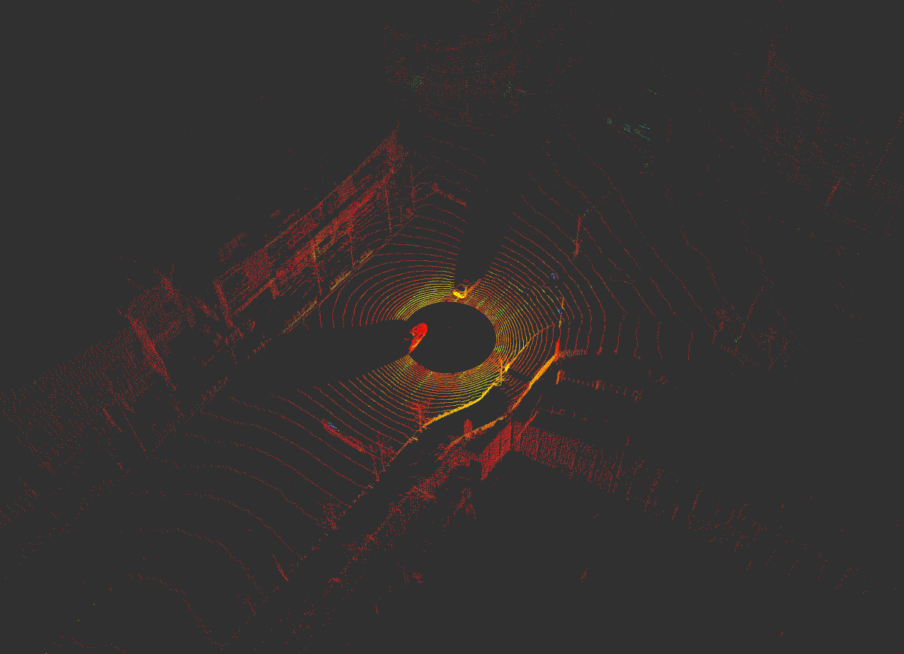
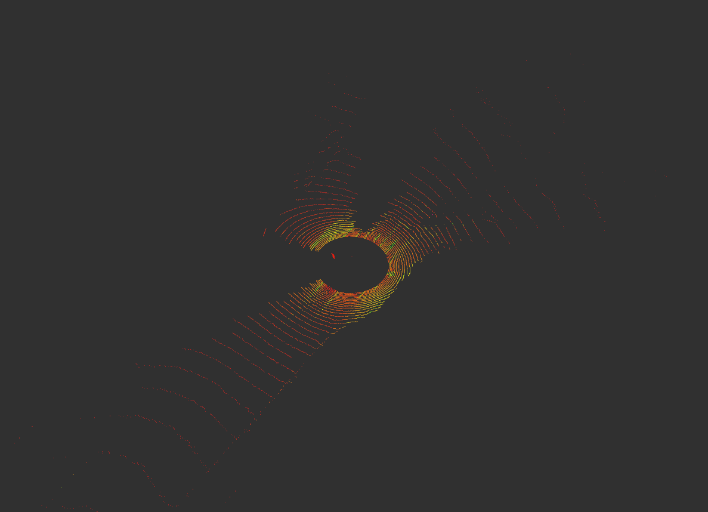
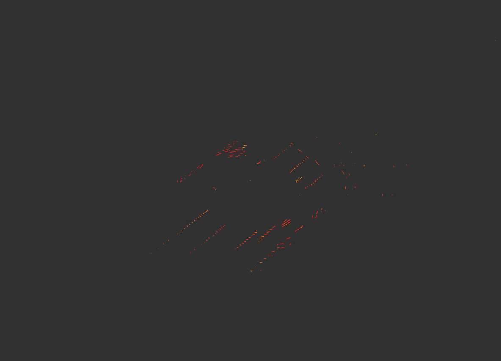
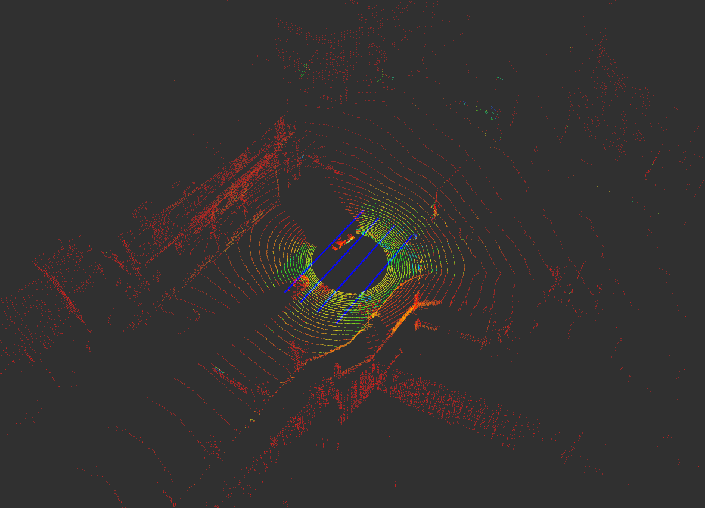
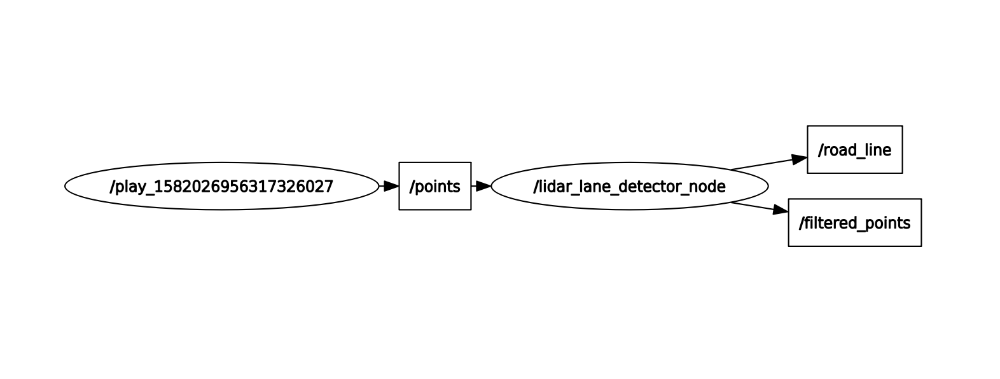

# lidar_lane_detector
***lidar_lane_detector*** is an open source ROS package for detecting road lines from raw 3D-LiDAR Sensor data.

- *Extracting drivable area by using azimuth and channel.*

- *Distinguish lines from road markings.*

- *Detecting not only nearest lines but also other lines.*

## Nodes
***lidar_lane_detector*** consists of only one node.

- *lidar_lane_detector_node*

## Requirements
***lidar_lane_detector*** requires following arguments.

- *pcl_ros*
- *pcl_conversions*
- *Parsing raw 3D-LiDAR data by azimuth and channel (using OS1-64 LiDAR Sensor as default in this package)*
  - If you are using *Velodyne LiDAR Sensor*, you can parsing raw 3D-LiDAR data by including *lidar_lane_detector/include/lidar_lane_detector/point_xyzir.h* and editing some code lines.

## Messages
- Subscribed Topics
  - */points* (sensor_msgs/PointCloud2)
- Published Topics
  - */filtered_points* (sensor_msgs/PointCloud2)
    - Point cloud data representing drivable area.
  - */road_line* (visualization_msgs/Marker)

## Parameters
- *channel_thresholds*
  - Range of interesting channel.
- *angle_thresholds*
  - Thresholds for classifying ground and non-ground obstacles. 
- *intensity_thresholds*
  - Thresholds for classifying asphalt and road markings, lines.
- *lane_candidate*
  - Number of lanes.
- *lane_width*
  - Width of each lane in *meter*
- *x_std_dev_threshold*
- *y_std_dev_threshold*
# lidar_lane_detector
